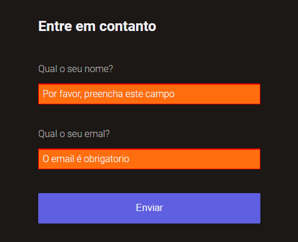
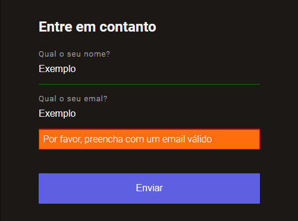

<h1> Formulario com validação customizada em JS </h1>

<h4>Exemplo 01</h4>

<h4>Exemplo 02</h4>

<h4>Exemplo 03</h4>

## Sobre:

O projeto consiste em modificar, atravéz do javaScrip, as mensagens de erro que veem por padrão do HTM. Colocando mensagens distintas para cada tipo de erro encontrado.
 Desenvolvido atravéz de uma aula da empresa **RocketSet**

## Linguagens utilizadas:

- HTML;
- CSS;
- JavaScript